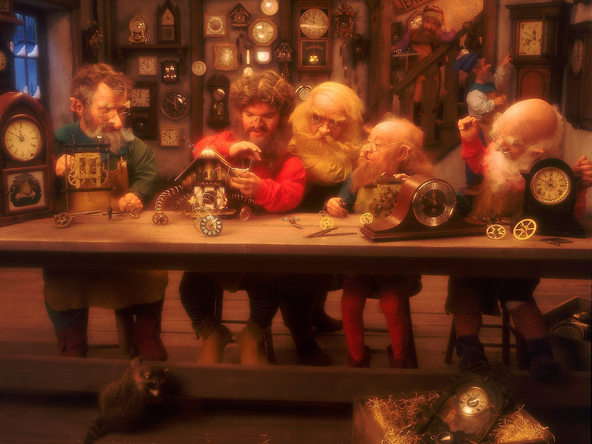

---

layout: sc5

style: |

    #Cover h2 {
        margin:30px 0 0;
        color:#FFF;
        text-align:center;
        font-size:70px;
        }
    #Cover p {
        margin:10px 0 0;
        text-align:center;
        color:#FFF;
        font-style:italic;
        font-size:20px;
        }
        #Cover p a {
            color:#FFF;
            }
    #Picture h2 {
        color:#FFF;
        }
    #SeeMore h2 {
        font-size:100px
        }
    #SeeMore img {
        width:0.72em;
        height:0.72em;
        }
---

# BEM CSS Workshop {#Cover}

*Brought you by [Varya Stepanova](http://varya.me) and generated by [Jekyller](https://github.com/shower/jekyller)*

<!-- photo by John Carey, fiftyfootshadows.net -->

## Theory

    .BLOCK{__ELEMENT[--MODIFIER]}

## Just a button

    <button class="button">Button button</button>
    Span button
    <a class="button" href="#">Link button</a>

<button class="button">Button button</button>
Span button
<a class="button" href="#">Link button</a>

## Selected button (modifier)

    <button class="button">Button</button>
    <button class="button button--selected">
      Selected button</button>

<button class="button">Button</button>
<button class="button button--selected">
  Selected button</button>

    $element.addClass('button--selected')

## Theme

    <button class="button">Button</button>
    <button class="button button--brand">Brand button</button>
    <button class="button button--brand button--selected">
      Selected brand button</button>

<button class="button">Button</button>
<button class="button button--brand">Brand button</button>
<button class="button button--brand button--selected">
  Selected brand button</button>

## Another theme

    <button class="button">Button</button>
    <button class="button button--night">Night button</button>
    <button class="button button--night button--selected">
      Selected night button</button>

<button class="button">Button</button>
<button class="button button--night">Night button</button>
<button class="button button--night button--selected">
  Selected night button</button>

## State as a modifier

    <button class="button">Button</button>
    <button class="button button--process">
      Doing smth button</button>

<button class="button">Button</button>
<button class="button button--process">Doing smth button</button>

    $element.toggleClass('button--process')

## Combine modifiers

    <button class="button button--brand button--process">
        Doing smth brand button</button>

<button class="button button--brand button--process">
    Doing smth brand button</button>

<button class="button button--night button--process">
    Doing smth brand button</button>

## SASS syntax

    .block
      prop: val

      &--mod
        prop: val

      &__elem
        prop: val

        &--mod
          prop: val

<!-- TODO: Show how it results -->

## Working example

## MindBEMding :-)

    $text__family-sans: "Proxima Nova", "Helvetica Neue", Helvetica, Arial, sans-serif;
    $text__size--beta: 30;
    $text__line--beta: 36;

    $text__colour--base: $color__neutral--dark;
    $text__colour--alpha: $color__primary;
    $text__colour--beta: $color__primary;

## Scalability

## File structure

## Multilingual structure

## Logic

## Libraries
